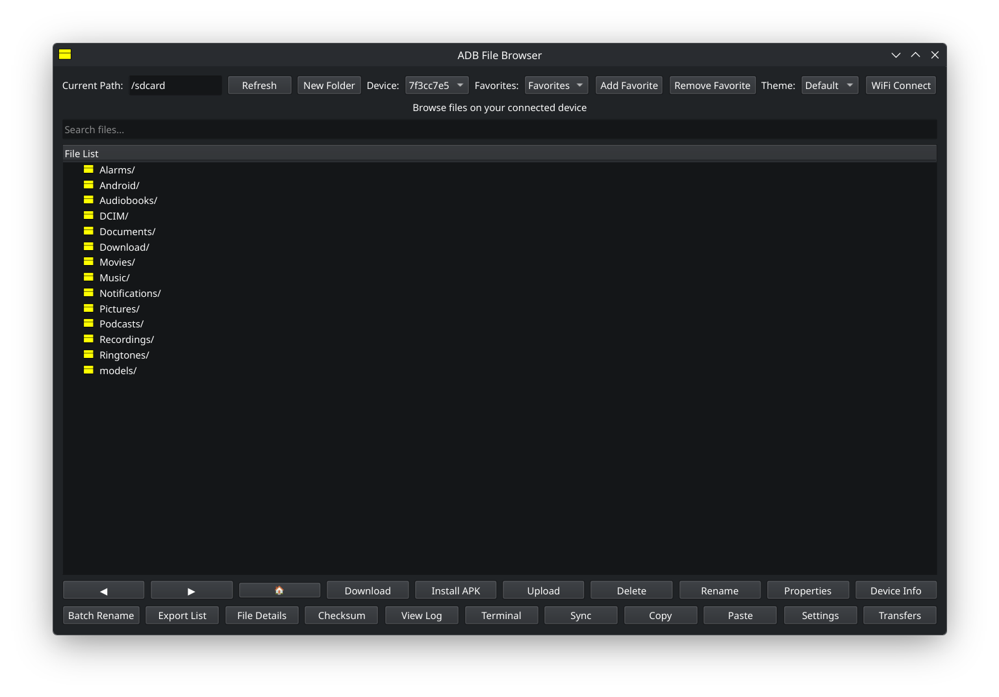

# ADB File Browser (PyQt6 Refactor)

A Python-based GUI for managing files on Android devices via ADB, rewritten in PyQt6.

## Features
- **File Management**: Browse, Download, Upload, Delete, Rename files.
- **Drag & Drop**: Upload files by dragging them into the window.
- **Transfer Window**: Track progress of file transfers in a separate window.
- **WiFi Connection**: Connect to ADB over WiFi easily.
- **Device Info**: View device properties.
- **Batch Rename**: Rename multiple files at once.
- **Terminal**: Execute custom ADB shell commands.


## Screenshot



## Installation
1. Ensure you have `adb` installed and in your PATH.
2. Install requirements:
   ```bash
   pip install -r requirements.txt
   ```

## Usage
Run the application:
```bash
python main.py
```

## Structure
- `src/ui/`: UI components (Main Window, Dialogs, Transfer Window).
- `src/utils/`: Utility functions (ADB wrapper, Icons).
- `src/workers.py`: Background threads for ADB operations.
- `main.py`: Entry point.
